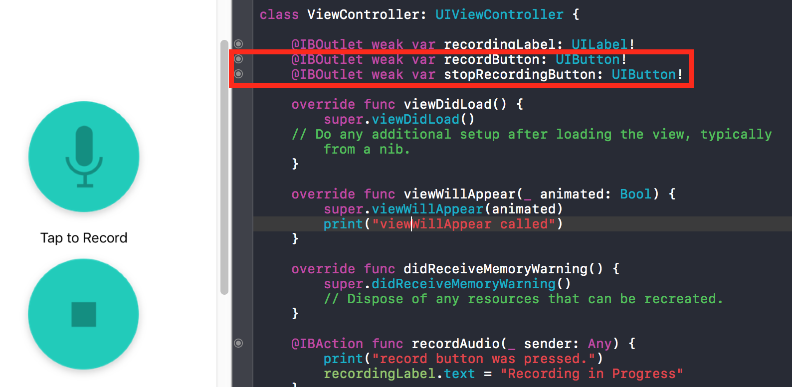
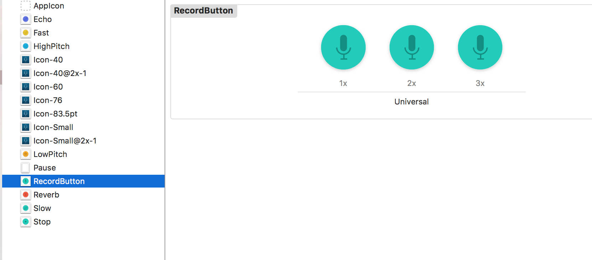
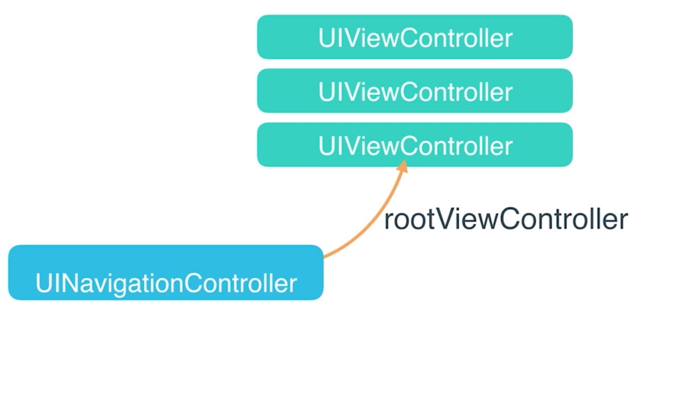
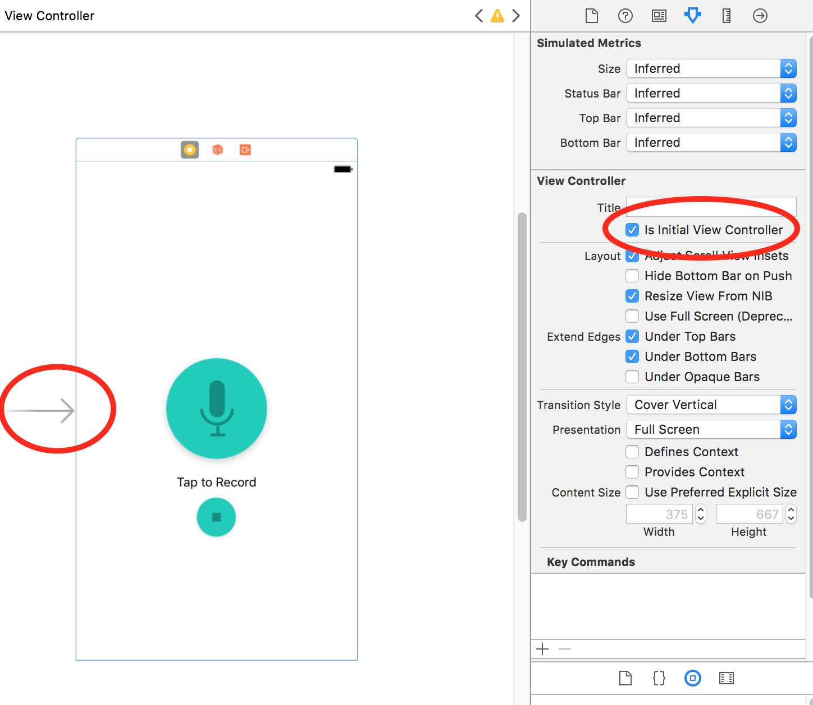
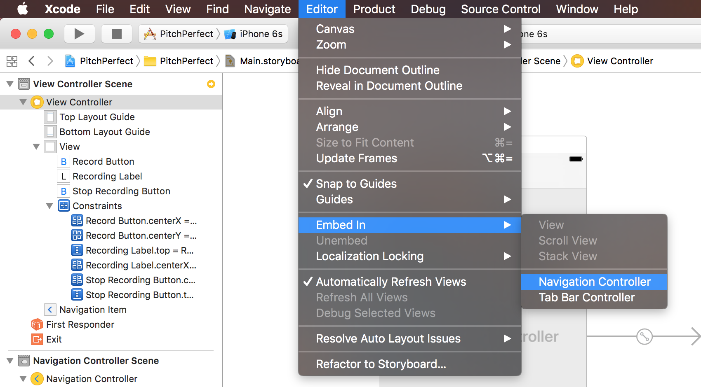

# View Controller and Multiple views

  View controller는 조금 특별한 종류의 클래스이다. 이름이 암시하듯 뷰를 컨트롤하고 뷰가 필요로하는 액션을 모두 관장한다! ios개발에서 이 클래스는 대부분 UIKit FrameWork에 있는 UIViewController의 하위 클래스임을 의미한다. ViewController는 특정 이벤트가 ViewContoller나 App전체에 발생하였을때 호출된다.


### Quiz
 Q : viewDidLoad 와 viewWillAppear 중 어떤 것이 먼저 호출될까?   

 A : viewDidLoad

viewDidLoad는 viewController 클래스가 메모리에 적재되었을 때 호출되고 viewWillAppear는 viewController가 view를 화면에 보여주기 직전에 호출된다.


### view Controller life cycle
![life cycle] (./view Controller life cycle.png)


event가 발생하기 전에 will fuction이 호출되고 event 발생 후에 did function이 호출된다. 

Remember that veiw and view controller are linked. UIViewController안에 있는 모든 subclass들은 적어도 하나의 UIView와 함께가는 IBOutlet을 가지고있다.(?)
=================

main.storyboard에서 `ctrl` + `drag` 를 통해 IBOutlet 추가


Assets에 image 추가
=====================

## 10. How to enable or disable a UI Button

 UI Button 문서에는 정확한 답변이 되어있지 않다. UI Control 문서로 가보자!

```swift
override func viewDidLoad() {
    super.viewDidLoad()
    // Do any additional setup after loading the view, typically from a nib.
    stopRecordingButton.isEnabled = false
}
```

`
# Multiple views

 이제부터는 여러 view를 만들고 서로 다른 view controller 간 이동하는 방법을 배우게된다. 여러 view를 다루려면 view controller사이를 탐색할 수 있는 또 다른 클래스가 필요하다.

- UINavigationContoller
- UITabbarController

## UINavigationContoller

 UINavigationContoller는 여러 view controller들을 담는 스택을 다루는 클래스이다.




rootViewController부터 시작해서 여러 view controller들을 스택에 쌓을 수 있다!




Storyboard 에서 회색 화살표가 가르키거나 Attributes inspector에서 *is Initial View Controller*가 체크되어 있는 뷰가 가장 처음 보게 될 뷰이다. 이것이 설정되어 있지 않다면 **Runtime Error!**



 UINavigationController 생성. 요놈이 이제 inital view Controller가 된다.


![root view] (./root view.png)  
 이 아이콘이 UINavigationController에 대한 root view임을 나타낸다.


and then, Action segue에서 show를 선택!


