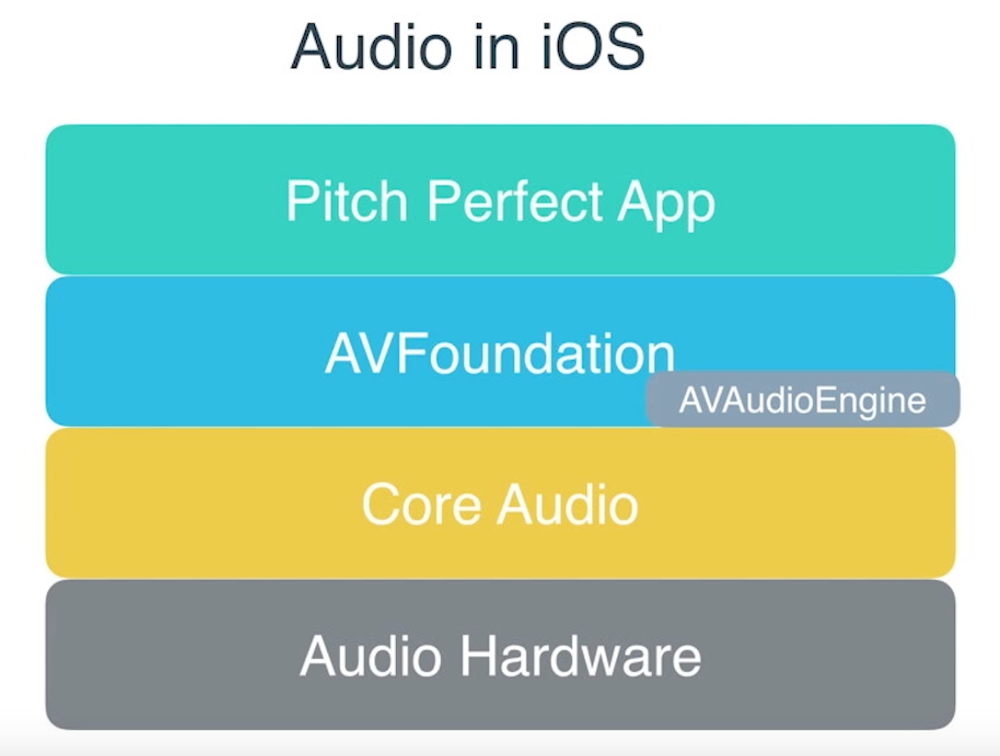
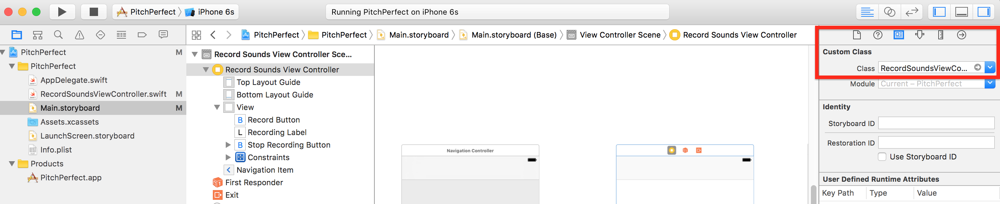
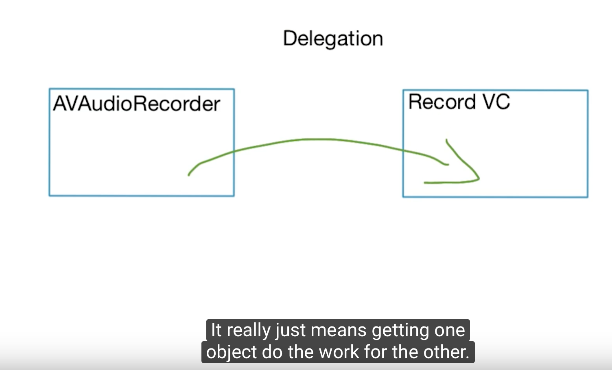

# Delegation and Recording

이번 레슨에서는 AVFoundation 이라는 frameworkd에 대해 소개할거다. 그중에서도 AVAudioEngine 클래스 사용하게 될거임ㅇㅇ  



## Remaing

View Controller 이름 바꾸기

![Rename1] (./Rename1.png)

Storyboard의 identity inspector에서 연결되는 Class도 바꿔주자.



## Adding AVAudioRecorder
RecordSoundsViewController.swift AVFoundaion을 추가하고 record 버튼과 stopRecord버튼에 동작을 추가했다.
```swift
import AVFoundation

@IBAction func recordAudio(_ sender: Any) {
    recordingLabel.text = "Recording in Progress"
    recordButton.isEnabled = false
    stopRecordingButton.isEnabled = true

    let dirPath = NSSearchPathForDirectoriesInDomains(.documentDirectory,.userDomainMask, true)[0] as String
    let recordingName = "recordedVoice.wav"
    let pathArray = [dirPath, recordingName]
    let filePath = URL(string: pathArray.joined(separator: "/"))

    print(filePath)

    let session = AVAudioSession.sharedInstance()
    try! session.setCategory(AVAudioSessionCategoryPlayAndRecord, with: AVAudioSessionCategoryOptions.defaultToSpeaker)

    try! audioRecorder = AVAudioRecorder(url: filePath!, settings: [:])
    audioRecorder.isMeteringEnabled = true
    audioRecorder.prepareToRecord()
    audioRecorder.record()
}

@IBAction func stopRecording(_ sender: Any) {
    recordButton.isEnabled = true
    stopRecordingButton.isEnabled = false
    recordingLabel.text = "Tap to Record"

    audioRecorder.stop()
    let audioSession = AVAudioSession.sharedInstance()
    try! audioSession.setActive(false)
}


```


================
이제 처리해야할 두가지 이슈가 남았다.
- *첫번째 뷰 컨트롤러*에서 *두번째 뷰 컨트롤러*로 오디오 파일 보내기
- *두번째 뷰 컨트롤러*는 온전한 파일을 받을때 까지 기다리긔

## Fixing the Sugue
먼저 두번째 이슈부터 처리해보자.

![Fixing Segue] (./Fixing Segue.png)


## Meaning of Word Delegate

설명하는 자막과 함께 캡쳐했다.

AVAudioRecorder는 아는게 없다. 단지 도구로서 할 일을 하고, 끝나면 View Controller에게 일이 끝났음을 알린다. 그 뒤 View Controller가 해야할 일을 한다. ~~아직 잘모르겠다~~


## Adding Delegation to RecordSoundsVC

- 먼저 *RecordSoundViewContoller(RSVC)*에게 *audioRecorder delegate protocol*을 수행할 것임을 알리자.
우리 Vies Controller는 *delegate protocol*을 쓸거고 *audioRecorder*를 위해 *delegate*처럼 작동할거라고 말하는거야.


Swift에서는 하나의 슈퍼클래스만 상속할 수 있지만 *protocol*은 원하는 만큼 쓸수 있다.
```swift
class RecordSoundsViewController: UIViewController, AVAudioRecorderDelegate {
    //code
}
```

- 다음 *audioRecoder*에게 우리 *View Controller*가 *Delegate*처럼 작동할 것이라고 알려주자.

```swift

@IBAction func recordAudio(_ sender: Any) {

    // 생략
audioRecorder.delegate = self
    // 생략
}

```
- 이제 *AVAudioRecorderDelegate* 함수중 하나를 작성하자
 언제 호출될지 함수명을 통해 유추가 가능하다😮 
```swift
func audioRecorderDidFinishRecording(_ recorder: AVAudioRecorder, successfully flag: Bool) {
    print("finished recording")
}
```


## Sending the Recorded Audio File

녹음이 끝나면, *stopRecording*이라는 위에서 만들었던 *Segue*를 호출하는 코드이다. *sender*라는 파라미터를 이용하여 *Segue*를 통해 보내고 싶은 것을 어떠한 것이든 보낼 수 있다. (`Any?`타입이더라)   
flag는 녹음파일 저장이 무사히 마쳤음을 알려준다.
```swift
func audioRecorderDidFinishRecording(_ recorder: AVAudioRecorder, successfully flag: Bool) {

    if flag {
        performSegue(withIdentifier: "stopRecording", sender: audioRecorder.url)
    }else {
        print("recording was not successful")
    }
}
```

## Creating the PlaySoundsViewController

 Project Navigator -> PitchPerfect 폴더 우클릭 -> Cocoa Touch Class, `Next` -> Class명, super Class 지정 -> PitchPerfect를 타겟으로 하고 -> `Create`

마지막으로 스토리보드에서 두번째 View Controller에게 방금 만든 Class를 주자.

![Create PSVC][./Create PSVC.png]


## Prepare for Segue and Receiving the Data

 먼저 *PlaySoundsViewController* 클래스에 아래 코드 추가 
```swift
var recordedAudioURL: URL!
```

그래도 아직 새로운 *View Controller*(PSVC)는 *Segue*나 우리가 보낸 audio URL이 triggered 되었을 때 무엇을 해야할 지모른다.(triggered를 어찌 해석해야될지 모르겠다. 보낼 준비가 되었을때?)   
이를 위한 *function*이 아래에 있는데 **기존코드**에 작성한다. **(Remeber it's called on the existing View Controller!!)**


```swift
override func prepare(for segue: UIStoryboardSegue, sender: Any?) {
    if segue.identifier == "stopRecording" {
        let playSoundsVC = segue.destination as! PlaySoundsViewController
        let recordedAudioURL = sender as! URL
        playSoundsVC.recordedAudioURL = recordedAudioURL
    }
}
```
1. `if`문에서 우리가 원하는 *Segue* 걸러냄
1. `segue.destination` 은 `UIViesController`형이므로 `PlaySoundsViewConroller` 로 upcast! (왜 up cast이지..)
1. sender로 넘어온 *AudioURL*을 PSVC의 프로퍼티 `recordedAudioURL`로 set


