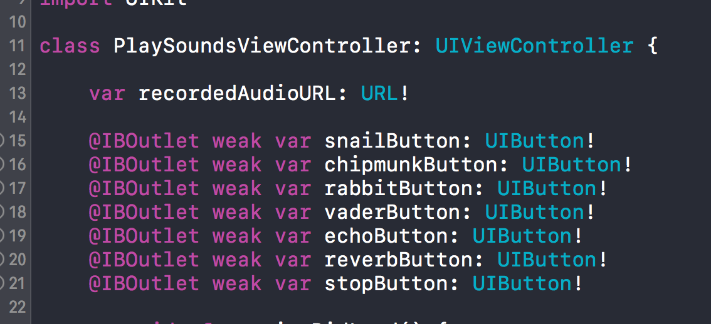
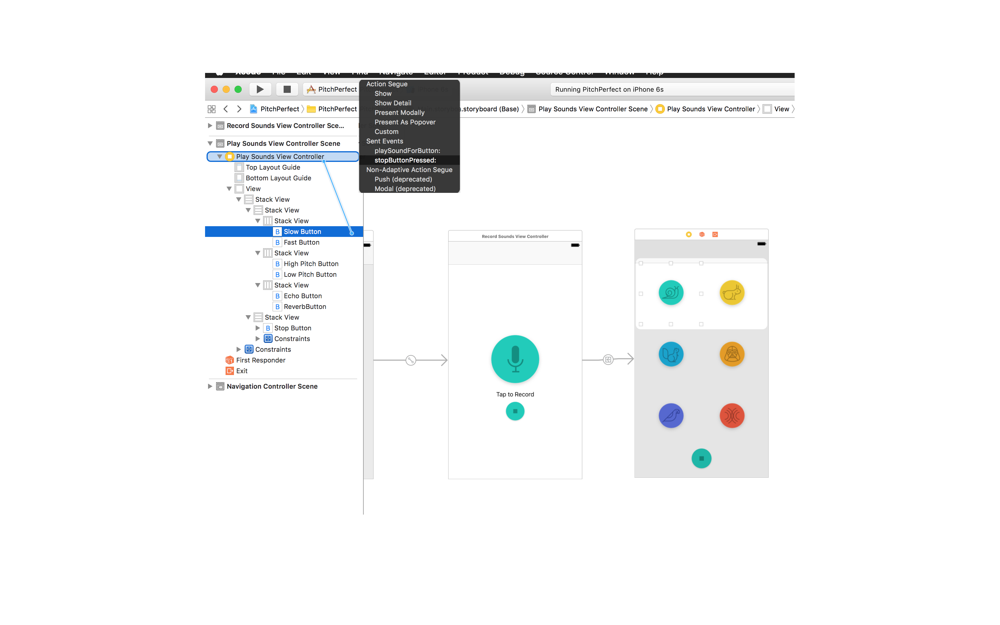

# Playback and Effects

이번레슨에서는 *audio playback*과 *stack view*에 대해 공부한다ㅇㅇ  
Stack View 는 *Autolayout Constraints*를 간편하게 만들어줄거야.

## StackViews as a Concept

*Stack View*에 쉽게 *UIElement*들을 넣고 배치할 수 있어. 수평, 수직 지향이 있고 *Stack View*안에 *Stack View*를 넣는것도 가능해. 그리고 그 안에서 *alignment, distribution, spacing*을 조절할 수 있지!
 ![StackViews as a Concept] (./StackViews as a Concept.png)

## Inserting StackViews
 
![Inserting StackViews] (./Inserting StackViews.png)

다음은 달팽이, 토끼버튼 넣기. 알아서하자😝

## 다음도 잘 그림따라서 잘 진행해보자


## Wiring up Buttons(IBOutlets + IBActions)

이제 View의 버튼UI를 View Controller 클래스와 연결해주어야하는데 조금 더 편한 방법을 해보자

1. PlaySoundsViewController에 코드를 먼저 작성!    


1. 다음과 같이 StoryBoard에서 Play Sounds View Controller를 `ctrl`클릭 후 각 버튼에 연결지어준다.  


1. 이번에는 IBAction을 만들어보자. 먼저 코드를 작성하고
```swift
// Mark : Actions

@IBAction func playSoundForButton(_ sender: UIButton){
    print("Play Sound Button Pressed")
}

@IBAction func stopButtonPressed(_ sender: AnyObject){
    print("Stop Audio Button Pressed")
}
```

1. 아까와는 반대로 버튼에서 Play Sounds View Controller로 이어주자



