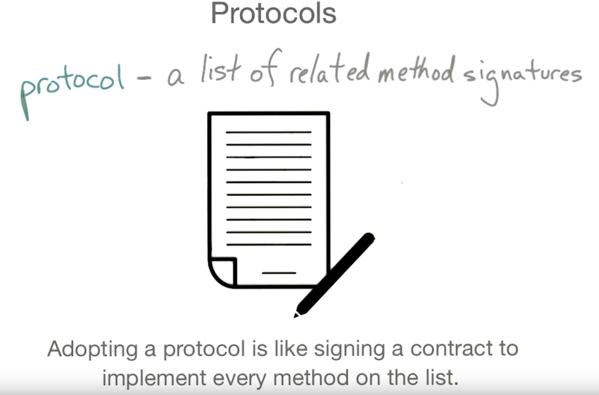

# Protocols and Extensions

 Protocolas and Extensions are both tools Swift uses to package modules of functionality that expand upon classes, enumerations and structs.

## Protocol

프로토콜은 특정한 일이나 기능의 일부에 대한 메소드나 속성이나 다른 요구사항들의 전체적인 모습을 정의한다. 실제로 이런 요구사항들의 구현을 제공하지는 않고, 그 구현이 어떻게 보일지에 대해 명시한다. 이 요구사항들을 실제로 구현된 클래스, 구조체, 열거형 등에 그 프로토콜이 적용될 수 있다. 프로토콜의 요구사항을 만족하면 어떤 타입이라도 그 프로토콜에 일치한다(conform)라고 말한다.

*Protocol*은 자바의 *interface*와 비슷하다. *iOS*개발에서는 *Delegate Pattern*의 중요한 요소이다.  


## Protocol Syntax

프로토콜을 클래스, 구조체, 열거체와 매우 비슷한 방법으로 정의한다.

```swift
protocol SomeProtocol {
    // 프로토콜 정의가 여기 온다
}
```
타입을 정의하는 곳에서 타입의 이름 뒤에 콜론(:)으로 구분해서 프로토콜의 이름을 써서 프로토콜을 커스텀 타입에 적용시킨다. 여러 프로토콜을 쉼표(,)로 구분해서 사용할 수 있다.
```swift
struct SomeStructure: FirstProtocol, AnotherProtocol {
    // 구조체 정의가 여기 온다
}
```
클래스가 부모를 가질 때는 프로토콜들 앞에 부모 클래스를 명시하고 쉼표로 구분해서 적용한다.
```swift
class SomeClass: SomeSuperclass, FirstProtocol, AnotherProtocol {
    // 클래스 정의가 여기 온다
}
```

강의에서는 **프로토콜을 사용한다는 것**은 약속된 메소드들을 구현하기로 **계약**한 것이라고 표현했다.

## A Protocol is Also a Type

```swift
protocol Souschef {
    func chop(vegetable: String) -> String
    func rinse(vegetable: String) -> String
}


class DinnerCrew {
    var members: [Souschef]

    init(members: [Souschef]) {
    self.members = members
    }
}
```

`members`배열의 entity들은 `Souschef` 프로토콜을 *conform*하는 타입이면 어떤 타입이나 상관없다!  라는걸 의미한다.


## Extensions

> 확장(Extensions)은 이미 존재하는 클래스, 구조체, 열거형 타입에 새 기능성을 추가합니다. 이는 원본 소스코드에 접근할 수 없는 타입들도 확장할 수 있습니다. (Retroactive modeling) 확장은 Objective-c 의 카테고리 와 유사합니다.

Extensions offer a way to add computed properties and methods to an existing class, struct, or enum.

다음 강의에서는 [Andre Bancroft의 블로그](https://www.andrewcbancroft.com/2014/07/27/fade-in-out-animations-as-class-extensions-with-swift/#fade-without-extension)에 있는 예제를 진행했다.


