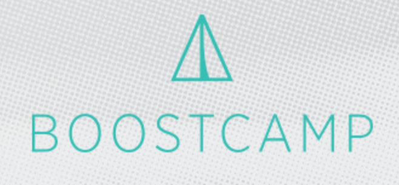

# [BoostCamp](http://boostcamp.connect.or.kr) with [Udacity](https://www.udacity.com)
**진도표**  ~~*(MarkDown 연습용)*~~

### - Intro to iOS App Development with Swift [[링크]](https://www.udacity.com/course/intro-to-ios-app-development-with-swift--ud585) ( 12/28 ~ 1/14)

- [x] [Lesson1][i1] Introduction & Xcode (12/28) 
- [x] [Lesson2](i2) AutoLayout & Buttons (12/31)
- [x] [Lesson3](i3) ViewController and Multiple Views (1/3)
- [x] [Lesson4](i4) Delegation and recording (1/10)
- [x] [Lesson5](i5) Playback and Effects (1/11)

[i1]:./Introto%20iOS%20App%20Development%20with%20Swift/Lesson1%20Introduction%20&%20Xcode/ReadMe.md

[i2]: https://asdfasdf  
(i3): http://www.naer.com  
i4 : http://www.naver.com

### - UIkit Fundamentals [[링크]](https://www.udacity.com/course/uikit-fundamentals--ud788) ( 1/15 ~ 1/28)

### - Swift Programming Syntax [[링크]](https://www.udacity.com/course/learn-swift-programming-syntax--ud902)

- [x] Lesson1 Swift Basics (12/30)
- [x] Lesson2 Optionals (1/3)
- [x] Lesson3 Collections (1/4)
- [x] Lesson4 Control Flow (1/4)
- [x] Lesson5 Funcions (1/5)
- [x] Lesson6 Classes, Properties, and Methods (1/6)
- [x] Lesson7 Enums and Structs (1/8)
- [ ] Lesson8 Protocols and Extensions
- [ ] Lesson9 Closure Expressions

[링크1][1] 과 [링크2][2].

[1]: http://example.com/ "링크제목1"
[2]: http://example.org/ "링크제목2"
