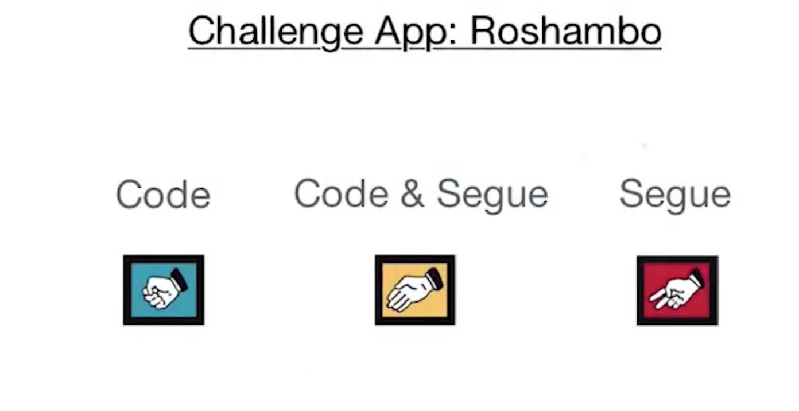

# View Presentation and Segues

새로운 내용의 콘텐츠를 화면에 보여주는 두가지 방법을 배워볼테다

1. Navigation
1. Modality

오늘은 modal presentation!

## How does a view get presented modally
첫번째 인자는 보고자 하는 ViewController의 참조이다.
```swift
self.presentViewController(controller, animated: true, completion: nil)
```

## Launch Image Picker and Activity View

UIImagePicker 뷰를 modal present 해보는 예제이다. 아래의 IBAction을 버튼에 연결해준다! 

```swift
@IBAction func experiment(){
    let nextController = UIImagePickerController()
    self.present(nextController, animated: true, completion: nil)
}
```
이 후 info.plist 에서 아래 표시한 *Row*를 추가해주어야한다.


안그러면 아래아 같은 에러가 발생한다.
The app's Info.plist must contain an NSPhotoLibraryUsageDescription key with a string value explaining to the user how the app uses this data.


`
## Launch Activity View and Alert View
- Activity View
```swift
@IBAction func experiment(){
    let image = UIImage()
    let nextController = UIActivityViewController(activityItems: [image], applicationActivities: nil)
    self.present(nextController, animated: true, completion: nil)
}
```


- Alert View  
```swift
@IBAction func experiment(){
    let nextController = UIAlertController()
    nextController.title = "Test Alert"
    nextController.message = "This is a test"

    // 아직 이구문이 어떻게 작동하는지 잘 모르겠다..!
    let okAction = UIAlertAction(title: "ok", style: UIAlertActionStyle.default ){
        action in self.dismiss(animated: true, completion: nil)
    }
    nextController.addAction(okAction)

    self.present(nextController, animated: true, completion: nil)
}

```


## Dice example
 2-1 번의 주사위 굴리기 예제다. 아래의 체크리스트를 확인하면서 App을 완성하자.


아래의 코드를 통해 Custom View를 만들었다.
```swift
@IBAction func rollTheDice() {
    var controller: DiceViewController

    // StoryBoard에 있는 뷰를 참조했다.
    // instantiateViewController는 AnyObject라 DiceViewController로 타입캐스팅 해주었다.
    controller = self.storyboard?.instantiateViewController(withIdentifier: "DiceViewController") as! DiceViewController

    // Controller간 데이터를 보내는 모습
    controller.firstValue = self.randomDiceValue()
    controller.secondValue = self.randomDiceValue()

    present(controller, animated: true, completion: nil)
}
```

## Demonstrate Code & Segue

아래와 같이 *Segue*를 생성하고, Identifier를 설정해준 후, `performSegue()`메서드를 통해 뷰를 전환해보자! (**주사위는 나오지 않을것이야!**)


```swift
@IBAction func rollTheDice(){
    performSegue(withIdentifier: "rollDice", sender: self)
}
```

## PrepareForSegue

모든 뷰 컨트롤러가 상속 받는`prepareForSegue()`메소드는 다뤄본 적이 있다.(~~자세한 설명은 생략한다~~)

```swift
override func prepare(for segue: UIStoryboardSegue, sender: Any?) {

    if segue.identifier == "rollDice" {

        let controller = segue.destination as! DiceViewController

        controller.firstValue = self.randomDiceValue()
        controller.secondValue = self.randomDiceValue()
    }        
}
```


## Challenge App: Roshambo

3가지 방법을 뷰를 전환해보자!



