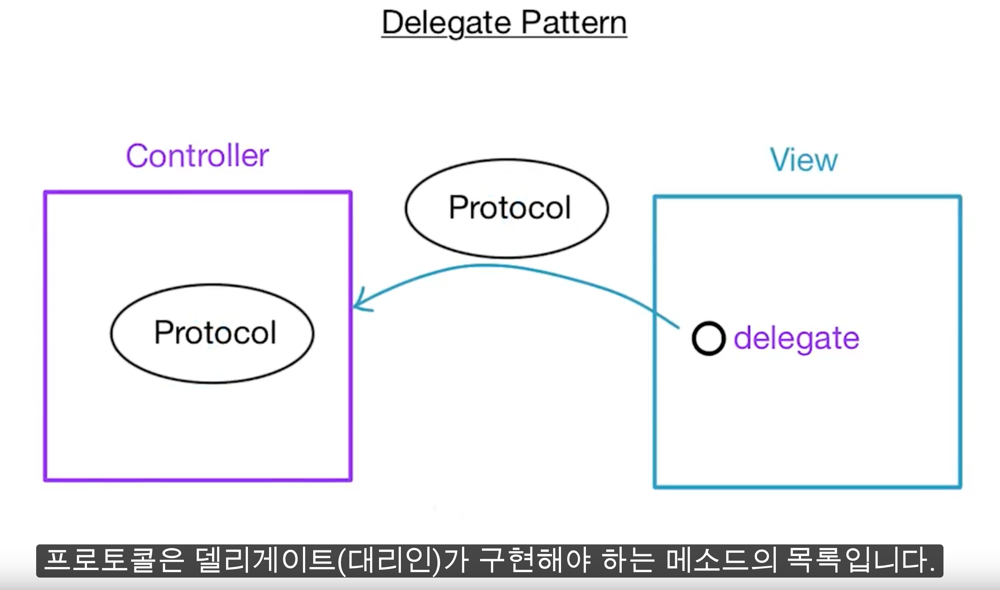
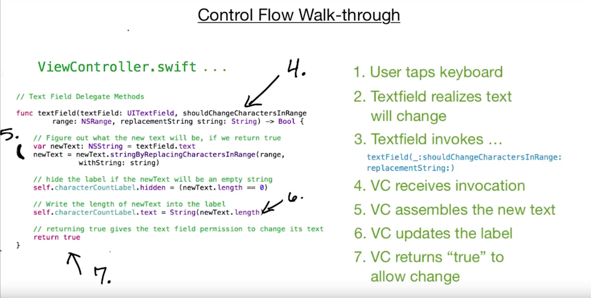

# The Delegate Pattern

이번 강좌에서는 *Delegate Pattern*에 대해 배우게 된다. 많은 UIView들이 이 디자인 패턴을 사용한다ㅇㅇ  
*Delegate*는 Model, View, Controller 사이에서 중요한 연결을 생성하는데 사용된다.

## Reuse with Customization
 *Delegate Pattern*은 같은 뷰 클래스가 다른 기능을 제공할 수 있게 해준다. (어떻게?)  
`view`는 있는 그대로 놔두고, `controller`와 `model`을 통해 자유롭게 커스터마이징하는거지.

> Delegate?  
an object that executes a group of methods on behalf of another object

다른 객체들을 대신, 메소드들을 실행하는 객체.

## Introducing to Protocols

**View**에서 일어난 변화에 대해 **Controller**가 대신 대응할 것이다. *Delegate Pattern*에 대한 핵심은 **View**가 *답변해야 할 질문*을 설정하고 *Protocol*에 적절한 답변들을 넣어 놓는것이다. 그 *Protocol*을 수행하는 모든 객체는 **Delegate(대리인)**이 될 수 있다.  




## Diagramming the Text Field App

왼쪽에 있는 3개의 클래스는 모두 UITextfieldDelegate 프로토콜을 conform하고 있다.  
3번째 TextField의 Delegate를 viewController로 해준 까닭은 뷰의 레이블을 조작해야하기 때문!  
![Diagramming the Text Field App] (./Diagramming the Text Field App.png)

아래는 viewController.swfit ...



# Challenge App
예제 3-1 App을 아

Here is a breakhallenge App:

- Zip code fieligits, and a maximum of five charac
- Cash text fies with the text $0.00, and then fi are added. For example, typing 4-2-.42, $4.27, $42.75.  
- Lockable text field and a switch. When the switch d. When the switch is off, the te


```swift
// 첫번째 TextFiled
class ZipCodeTextFieldDelegate: NSObject, UITextFieldDelegate {

    func textField(_ textField: UITextField, shouldChangeCharactersIn range: NSRange, replacementString string: String) -> Bool {

    /*
        textField 는 수정되기 `전`의 TextField를 가리킨다.
        range.location은 수정이 시작되는 위치. (0부터 센다.)

        수정되기전에 5글자가 있는 상태에서, 6번째 위치에 글자를 추가하는 경우에 수정을 허락하지 않는다.


        (count는 갯수를 나타내고
        location은 string의 위치를 0부터 세서 좀 헷갈린다😝)
    */

    if (textField.text?.characters.count)! > 4  && range.location > 4{
        return false
    }
        return true
    }
}

```

두번째 텍스트필드 델리게이트 클래스를 만드는 데 애먹었다ㅜㅠ
삽질한 내역  
 1. String의 Index를 이해하지 못햇다.  
String이나 CharacterSet을 조작할 때, 배열의 Index로 접근하려했는데 String.Index 인스턴스를 이용해서 접근해야했다. Swift의 Array는 사실 연결List를 이용해서 만든 것처럼 기존 내가 알던 C나 Java에서 처럼 배열의 인덱스를 이용해서 접근하는 개념이 아닌가부다.

 1. 반 개방 범위 연산자(Half-Open Range Operator)  
 `a..<b`는 는 지원하지만 `a<..b`나 `a<..<b`따위는 지원하지 않는다.ㅋ,ㅋ


```swift
// 두번째 
func textField(_ textField: UITextField, shouldChangeCharactersIn range: NSRange, replacementString string: String) -> Bool {

    // 숫자 or delete만 입력되는 것으로 가정
    // textField.text : $13.40 꼴

    var oldText : String = textField.text ?? ""
    if oldText.isEmpty {
        oldText = "$00.00"
    }

    let commaIndex = oldText.characters.index(of: ".")!
    let startIndex = oldText.index(oldText.startIndex, offsetBy: 1)

    var dollarString : String = oldText.substring(with: startIndex ..< commaIndex)
    var centString : String = oldText.substring(from: oldText.index(after: commaIndex))

    if let _ = Int(string){
        let moveString = String(centString.characters.removeFirst())
        dollarString = dollarString + moveString
        centString += string
    }else {
        let moveString = String(dollarString.characters.removeLast())
        centString = moveString + centString
        centString.characters.removeLast()
    }


    if dollarString.characters.count < 2 {
        dollarString = "0" + dollarString
    }else if dollarString.characters.index(of: "0") == dollarString.startIndex {
        dollarString.characters.removeFirst()
    }

    textField.text = "$\(dollarString).\(centString)"

    return false
}
```


