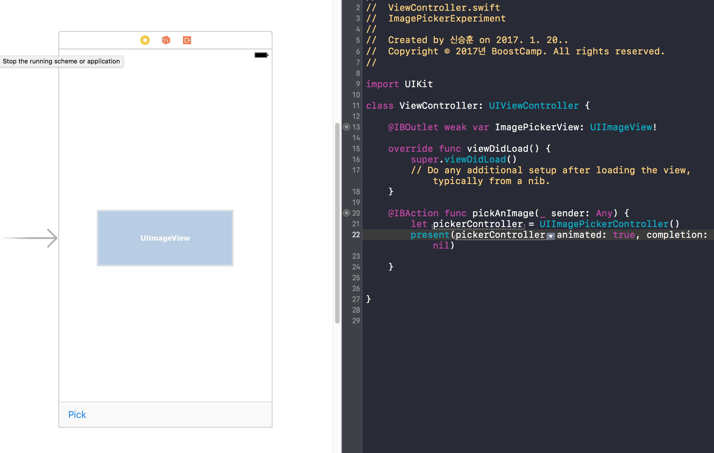

# Build v1.0 MemeMe App

이제 배운걸 토대로 Meme App을 만들기 위한 과정을 차근차근 진행해보자! 


## MemeMe 1.0 To-Do List
- [ ] Picking an image
- [ ] Editing and displaying text with style
- [ ] Moving a view out of the way of the keyboard
- [ ] Sharing a meme

## Picking Image
 이미지를 선택하는 연습을 다시 해보자. Toolbar를 만들고 UIImagePickerController를 만들었다.



## Researching the UIImagePicker Delegate

이제 *Delegate Patter*을 이용해서 사진을 선택하거 취소했을 때의 동작을 구현해보자!  

*UIImagePickerController*를 보면 두 가지의 이벤트가 발생할 것임을 직관적으로 알 수있다.  
- Image or Movie를 선택하거나
- 취소하거나

잠깐 그전에 [UIImagePickerControllerDelegate](https://developer.apple.com/reference/uikit/uiimagepickercontrollerdelegate)를 살펴보고 오자.

이제 우리가 해야할 건 다음과 같다.  
- Add the protocol to the class declaration
- Copy in the two methods.
- Remember to set the delegate before launching your imagePicker:


그런데 여기서 알아야할점.
```swift
class ViewController: UIViewController, 
    UIImagePickerControllerDelegate,
    UINavigationControllerDelegate {
}
```

클라스가 UIViewController의 Delegate가 되려면 *UINavigationControllerDelegate*도 수행할 수 있는 클래스여야한다.   
이제 Delegate를 지정해주자
```swift
@IBAction func pickAnImage(_ sender: Any) {

let imagePicker = UIImagePickerController()
    imagePicker.delegate = self
present(imagePicker, animated: true, completion: nil)
}
```

이제 Image를 선택하거나 취소했을때의 동작을 정의하는 함수를 구현한닷.

```swift
func imagePickerController(_ picker: UIImagePickerController,
    didFinishPickingMediaWithInfo info: [String : Any]) {


}
func imagePickerControllerDidCancel(_ picker: UIImagePickerController) {

}
```

아참 info.plist에서 Privacy - Photo library de@#$@# 이러 추가하는것 잊지말자.

## Receiving an Image Using a Delegate

`imagePickerController(_ picker: UIImagePickerController,
didFinishPickingMediaWithInfo info: [String : Any])` 사진에 대한 정보를 `[String: Any]`타입의 `Dictionary`로 받는다.  
이 `Dictionary`의 Key 값은 [Editing Information Keys](./https://developer.apple.com/reference/uikit/uiimagepickercontrollerdelegate/1658409-editing_information_keys)에서 확인할 수 있다.

그리하여 아래와 같이 imageView를 설정할 수 있다.

```swift
if let image = info[/* TODO: Dictionary Key Goes Here */] as? UIImage {
    imagePickerView.image = image

// Key값으로 UIImagePickerControllerOriginalImage를 썻다.  
}
```
**흠...근데 한번 이미지를 선택하고나면 pick 버튼이 동작하지 않는다.**  
*[Generic] Creating an image format with an unknown type is an error* 이란 에러메세지가 계속 뜬다'ㅁ'  
에러메세지 때문에 pick 버튼이 동작하지 않았던 것이 아니라 imageView를 불러오면서 toolBar를 밀어내서 버튼을 누를수가 없는 현상이었다. toolBar의 Content Compression Resistance Priority를 조금 높게 설정해서 해결했다.
~~일단 패스~~

## What about Camera?

카메라도 [UIImagePickerContoller](https://developer.apple.com/reference/uikit/uiimagepickercontroller#//apple_ref/c/tdef/UIImagePickerControllerSourceType)에서 불러올 수 있다. UIImagePickerCotroller의 `sourceType` 속성을 통해 카메라에서 사진을 불러올 것인지, 앨범에서 사진을 가져올 것인지를 선택할 수 있다.

`sourceType`의 3가지 옵션  
- .camera
- .photoLibrary
- .savedPhotosAlbum


그런데 simulator는 카메라를 사용할 수 없으므로 *viewWillAppear()*에서 아래 코드를 통해 카메라 버튼을 막아두자
```swift
cameraButton.isEnabled = UIImagePickerController.isSourceTypeAvailable(.camera)
```

## Textfield Specifications
 아래 항목을 잘 따라하자.
>Let’s think about the specifications for the MemeMe textfields.

1. There should be two textfields, reading “TOP” and “BOTTOM” when a user opens the Meme Editor. You can set a textfield’s initial text by setting its text property in viewDidLoad.

2. Text should be center-aligned. For this you can set the textfield’s textAlignment property in viewDidLoad.

3. Text should approximate the "Impact" font, all caps, white with a black outline. For this we will make use of the defaultTextAttributes dictionary that governs font appearance. Details to come in the next segment.

4. When a user taps inside a textfield, the default text should clear. This can be accomplished in textFieldDidBeginEditing method. Be sure to remove default text only, not user entered text.

5. When a user presses return, the keyboard should be dismissed. This can be accomplished in textFieldShouldReturn.

`textField.resignFirstResponder()` 메서드로 키보드를 내려주자

## Working with Text Attributes

다른 건 다 동작하는데 이 Text Attributes란 놈이 맘대로 잘 안된다.

[Udacity 강의노트] (./https://classroom.udacity.com/courses/ud788/lessons/4798201455/concepts/37669185700923#) 대로 따라만 하면되는데

```swift
let memeTextAttributes:[String:Any] = [
    NSStrokeColorAttributeName: /* TODO: fill in appropriate UIColor */,
    NSForegroundColorAttributeName: /* TODO: fill in appropriate UIColor */,
    NSFontAttributeName: UIFont(name: "HelveticaNeue-CondensedBlack", size: 40)!,
    NSStrokeWidthAttributeName: /* TODO: fill in appropriate Float */]
```
저기서 `NSForegroundColorAttributeName` 가 잘 동작하지 않는다. 윤곽선을 Black으로 지정하고나면 글자색이 투명이 되어버린다...암! 

## 여기서부터는 다 일일이 기록하지 못하겠다ㅜㅠ

일단

- 키보드가 올라오면 뷰의 위치를 이동 (키보드 높이만큼) [Notification 이용]
- Memed 처리된 Image를 저장 or 공유 기능

을 구현하였따리

 


