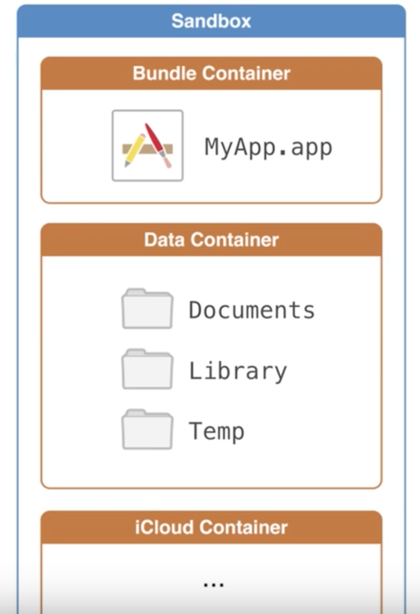

# iOS File System and Sandboxing

> Here are some similarities between the two file systems (iOS and OSX):

Similarities:
-They are both Unix based. If you don’t know what this means, never mind. ;-)
-Both have special folders called Documents or Library for each user (OSX) or App (iOS)
-Both may sync content with the cloud by using iCloud

Differences:
-While the security (who can access which folders) on OSX is relatively lax, on iOS it is extremely strict.
-The absolute paths for key folders in OSX, such as your home folder, don’t change every time you boot your Mac. On iOS, on the other hand, the absolute path for key folders will change.

## SandBox

Bundle에는 주로 executive code 들  
Doucuments 에는 user-data, 중요 데이터
Library 에는 non-user-data, 유저에게 보여지지 않는 것들.    
**Caches**

UserDefalut는 library에 저장됨 (Library/Preferences/info.myapp.mobile.plist)

In order to save something in the sandbox, we need to do two things,
- FileManager to get the to the sandbox
- String to write or to read text files
- NSData to write or read binary files
