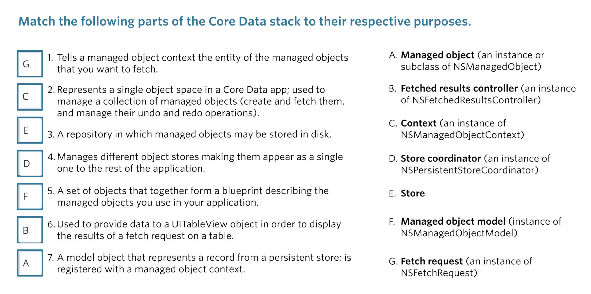

# Core Data (Part 1)

## Core Data Architecture

- Object Model : class 나 relationshp 을 구체화하기 위한 것, SQL의 테이블과 row
- Managed Object : saves the contents of its properties a DB file
- Context : where most of the action happens. The context is where your *Managed Object* live until they're save to dist
- Fetch Request : search of the context for certain type of managed object.
- Fetch Requests Controller : part of controller layer. controls how data from a request is displayed in a view. *keep the model and view in sync.*

- Store : Stores are managed objects actually get stored when saved to disk. (DB files) (XML, binary format, SQLite)
- Store Coordinator

-> Core Data Stack

